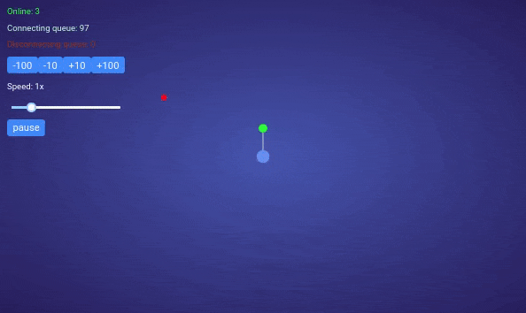

# Sputnik - the Unit of the Orbital Network

Orbital Network is running by the distributed nodes (Sputnik) with the [SON](https://en.wikipedia.org/wiki/Self-organizing_network) feature.

## Features

### Distributed Network Architecture

Explanation of SON implementation and interactions with the Core Platform. [Read more...](docs/network.md)
Here is demo how self organiznig network works

### Development

#### Coding conventions

All the details of code style and best practice https://github.com/golang/go/wiki/CodeReviewComments

#### Contribute

We welcome contributions to Sputnik in many forms, and there’s always plenty to do!

**Setting up the development environment**

Prerequisites

- Git client
- Go - 1.10 or later

Make sure you have properly setup your Host’s [GOPATH environment variable](https://golang.org/doc/install#install).

We use 'dep' for vendoring, but it's strongly recomend to discus the adding new dependency to the project.

Setup 'dep' ([more details](https://github.com/golang/dep))

    go get -u github.com/golang/dep/cmd/dep

## Releases

- [Alpha](https://github.com/orbitalnetwork/sputnik/releases/tag/alpha)
- [v.0.1.0] comming soon

## License 

Sputnik source code files are made with ❤ and available under the Apache License, Version 2.0 (Apache-2.0), located in the [LICENSE](LICENSE) file. Sputnik documentation files are made available under the Creative Commons Attribution 4.0 International License (CC-BY-4.0), available at http://creativecommons.org/licenses/by/4.0/.

